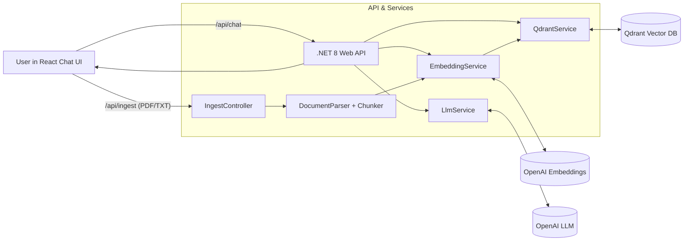

# Company Intelligence FAQ Chatbot
*A production-grade, full-stack RAG starter using React + .NET 8 + Qdrant + OpenAI*

This repository delivers a complete Retrieval-Augmented Generation (RAG) system that ingests company knowledge (PDF/TXT), stores embeddings in a vector database, and serves grounded answers through a modern chat UI.

> **What this is:** a clean architecture you can demo to founders/CTOs/investors and extend into a real product.

---

## Use Cases
- Internal FAQ (HR/IT policies, onboarding)
- Support Copilot (answer from ticket history)
- Sales Enablement (product docs, pricing FAQs)
- Compliance Q&A (retrieve the exact rule text)
- Reviews QA pattern (5,000+ reviews -> fast, grounded answers)

---

## Architecture


Also included as a PNG: `docs/architecture.png`


**Design choices**
- Qdrant (cosine, 3072-dim) with OpenAI embeddings
- Thin controllers, testable services
- Stateless API; add Redis cache later

---

## Repository Layout
```
.
├─ backend/ (ASP.NET Core 8 API)
├─ frontend/ (React + Vite)
├─ docs/ (architecture.png, api.http)
├─ sample-data/ (seed docs to ingest)
├─ docker-compose.yml
└─ .env.example
```

---

## Quickstart (Local Dev)
**Qdrant**
```bash
docker compose up -d qdrant
```

**API**
```bash
cd backend/src/CompanyIntelligence.Api
dotnet restore
export OPENAI_API_KEY=sk-...
export QDRANT_URL=http://localhost:6333
export QDRANT_COLLECTION=company_knowledge
export OPENAI_MODEL=gpt-4o-mini
export OPENAI_EMBEDDING_MODEL=text-embedding-3-large
dotnet run
# Swagger: http://localhost:5088/swagger
```

**Web**
```bash
cd frontend
echo "VITE_API_BASE=http://localhost:5088" > .env
npm i
npm run dev
# http://localhost:5173
```

**Try it**
- Upload `sample-data/company_policy_example.txt`
- Ask: "What's our refund policy for premium users?"

---

## Environment Variables
**Backend**
- OPENAI_API_KEY (required)
- OPENAI_MODEL (default gpt-4o-mini)
- OPENAI_EMBEDDING_MODEL (default text-embedding-3-large)
- QDRANT_URL (default http://localhost:6333)
- QDRANT_COLLECTION (default company_knowledge)

**Frontend**
- VITE_API_BASE (default http://localhost:5088)

---

## REST API
- `POST /api/ingest` (multipart `file`) -> chunks+embeds and upserts to Qdrant
- `POST /api/chat` -> returns answer + sources

See `docs/api.http` for runnable requests.

---

## Production Tips
- Add JWT/Auth0 auth and RBAC
- Redis cache for frequent Q&A
- Hybrid search + cross-encoder rerank
- Rate limiting and audit logs
- Deploy with docker-compose or separate services

---

## License
MIT
